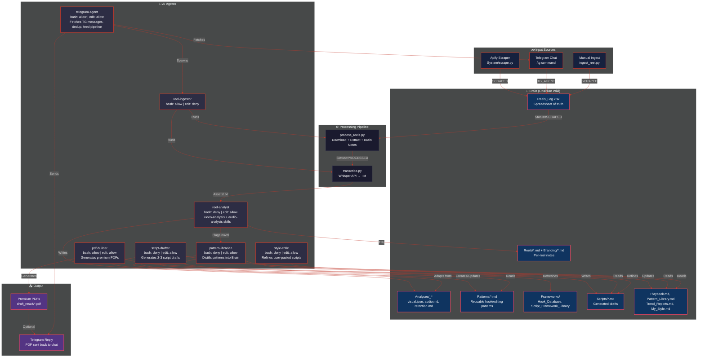
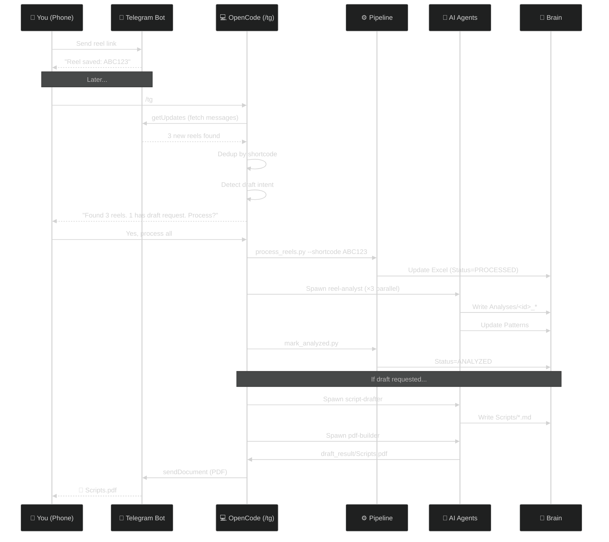

# Instagram.AI

> **Personal reel intelligence pipeline** — scrape Instagram Reels, analyze patterns with AI agents, and generate ready-to-shoot scripts from your Brain.

[](https://www.python.org/)
[](https://opencode.ai)
[](./LICENSE)

---

## Overview

Instagram.AI is a local intelligence pipeline that:

- **Scrapes** Instagram Reels from your creator watchlist (via Apify)
- **Ingests** media — downloads video, extracts keyframes + audio (yt-dlp + ffmpeg)
- **Transcribes** audio to text (Whisper API)
- **Analyzes** visual patterns, audio hooks, and retention psychology (AI agents)
- **Distills** patterns into a durable Brain knowledge graph
- **Generates** ready-to-shoot reel scripts adapted to your niche
- **Accepts reels from Telegram** — send links from your phone, process them later

All of this runs locally on your machine. No cloud hosting required (except OpenAI Whisper API for transcription).

---

## Architecture



---

## Pipeline

| Step | Command | Effect |
|---|---|---|
| **1. Scrape** | `uv run System/scrape.py --category NICHE\|BRANDING\|ALL [--max-reels N]` | Apify metadata → `Brain/Reels_Log.xlsx`, Status=SCRAPED |
| **2. Process** | `uv run System/process_reels.py [--shortcode <id>] [--shortcodes <id> ...] [--limit N] [--checkpoint-every N]` | Downloads + validates/extracts media, creates Brain note, Status=PROCESSED after scoped transcription |
| **3. Transcribe** | `uv run System/transcribe.py [--shortcode <id>] [--shortcodes <id> ...]` | Whisper → `Assets/<id>.txt` (auto-chains for exact processed IDs) |
| **4. Analyze** | `/analyze` command (opencode) | Spawns `reel-analyst` agents → writes `Brain/Analyses/<id>_*` |
| **5. Mark** | `uv run System/mark_analyzed.py [--shortcodes <id> ...]` | Valid analysis trios → Status=ANALYZED |
| **6. Distill** | `/sync` or spawn `pattern-librarian` | Patterns → `Brain/Patterns/`, `Playbook.md`, etc. |
| **7. Draft** | `/draft <topic>` or `/redraft <reel_url>` | `script-drafter` → `Brain/Scripts/<Title>.md` |
| **8. PDF** | `/draft` (auto) or spawn `pdf-builder` | Scripts → `draft_result/<Topic>.pdf` |

**Status lifecycle:** `SCRAPED → PROCESSED → ANALYZED`

For a registered one-off reel, run `uv run System/register_oneoff.py <url>`
then `uv run System/process_reels.py --shortcode <id>`. This keeps the reel in
the Excel lifecycle and makes it eligible for guarded cleanup. Use
`System/ingest_reel.py` only as the raw asset utility.

Performance snapshots are append-only via
`uv run System/record_outcome.py --shortcode <id> ...` and are stored under
`Brain/Outcomes/` for later score calibration.

---

## Telegram Integration

Send Instagram reel links from your phone to your Telegram bot. Process them later via `/tg`.



### How it works

1. **Send links** — Text your Telegram bot with Instagram reel URLs
2. **Fetch** — Run `/tg` in opencode. The `telegram-agent` fetches messages, extracts URLs, deduplicates by shortcode
3. **Present** — Agent shows you what it found and asks what to do
4. **Process** — Reels enter the **same pipeline** as Apify-scraped reels (no separate path)
5. **Draft** — If a message said "draft 2 scripts based on this", scripts are generated after analysis
6. **Deliver** — PDFs are sent back to your Telegram chat

### Setup

```bash
# 1. Create a Telegram bot via @BotFather, get the token
# 2. Add to .env
TELEGRAM_BOT_TOKEN=your_token_here
TELEGRAM_ALLOWED_CHAT_ID=your_chat_id

# 3. Send a test message to your bot, then fetch it
uv run telegram_bot/fetch_messages.py --dry-run
```

---

## Agent System

| Agent | Permissions | Role |
|---|---|---|
| `reel-ingestor` | bash ✓ | Runs pipeline scripts (scrape, process, transcribe, mark, cleanup) |
| `reel-analyst` | edit ✓ | Analyzes keyframes + transcript, writes `Brain/Analyses/<id>_*` |
| `pattern-librarian` | edit ✓ | Distills patterns into `Brain/Patterns/`, updates Playbook |
| `script-drafter` | edit ✓ | Generates 2-3 reel script drafts using Brain knowledge |
| `style-critic` | edit ✓ | Refines user-pasted scripts against rubric + My_Style |
| `telegram-agent` | bash ✓ edit ✓ | Fetches Telegram messages, deduplicates, feeds pipeline |
| `pdf-builder` | bash ✓ edit ✓ | Builds premium magazine-style PDFs from scripts |

### Commands

| Command | Description |
|---|---|
| `/sync [NICHE\|BRANDING\|ALL]` | Full pipeline: scrape → process → analyze → distill |
| `/analyze [shortcode\|pending]` | Parallel analysis of unanalyzed reels |
| `/draft <topic>` | Generate 2-3 script drafts from the Brain |
| `/redraft <reel_url>` | Ingest → analyze → 2-3 niche-adapted redrafts |
| `/refine <script>` | Critique + refined draft vs rubric & My_Style |
| `/tg [--dry-run]` | Fetch reel links from Telegram, feed into pipeline |

---

## Brain Structure

```
Brain/
├── Reels_Log.xlsx          # Spreadsheet of truth (deduped by shortcode)
├── Reels/                  # NICHE reel notes (per-shortcode .md)
├── Branding/               # BRANDING reel notes (per-shortcode .md)
├── Analyses/               # Agent outputs (visual.json, audio.md, retention.md)
├── Creators/               # _registry.json — processed shortcodes per creator
├── Patterns/               # Reusable hook/editing patterns (wiki-linked)
├── Frameworks/             # Hook_Database.md, Script_Framework_Library.md
├── Scripts/                # Generated script drafts
├── Playbook.md             # Aggregated playbook
├── Pattern_Library.md      # Pattern index with confidence scores
├── Trend_Reports.md        # Trend observations (2+ reels required)
├── My_Style.md             # Your personal style rules (edited by style-critic)
└── Rubric.md               # FIXED scoring rubric (never edited)
```

All notes use **Obsidian wiki-links** `[[Node Name]]` for cross-referencing.

---

## Setup

### Prerequisites

- **Python 3.13** (pinned in `.python-version`)
- **uv** (Python package manager) — [install](https://docs.astral.sh/uv/getting-started/installation/)
- **ffmpeg** on `PATH` (for audio extraction)
- **OpenCode** — [install](https://opencode.ai)
- **APIFY_API_KEY** — [get one](https://apify.com/)
- **OPENAI_API_KEY** — [get one](https://platform.openai.com/)

### Installation

```bash
# Clone the repo
git clone https://github.com/RAHULREDDYYSR/Instagram.AI.git
cd Instagram.AI

# Install dependencies
uv sync

# Set up environment
cp .env.example .env
# Edit .env with your API keys

# Verify ffmpeg
ffmpeg -version
```

### First Run

```bash
# 1. Scrape creators (edit System/creators.json first)
uv run System/scrape.py --category NICHE --max-reels 5

# 2. Process reels (download + extract + transcribe)
uv run System/process_reels.py --category NICHE --limit 5

# 3. Analyze in opencode
# Open opencode and run: /analyze

# 4. Distill patterns
# In opencode: spawn pattern-librarian

# 5. Generate scripts
# In opencode: /draft "discipline over motivation"
```

---

## Configuration

### `System/creators.json`

Edit this file to add/remove creators from your watchlist:

```json
{
  "creators": [
    {
      "username": "creator_handle",
      "category": "NICHE",
      "scraped_reels": [],
      "processed_reels": []
    }
  ]
}
```

### `.env`

| Variable | Required | Description |
|---|---|---|
| `APIFY_API_KEY` | Yes | Apify API key for scraping |
| `OPENAI_API_KEY` | Yes | OpenAI key for Whisper transcription |
| `TELEGRAM_BOT_TOKEN` | Optional | Telegram bot token (for `/tg` command) |
| `TELEGRAM_ALLOWED_CHAT_ID` | Optional | Your chat ID (whitelist) |

---

## Tech Stack

| Component | Technology |
|---|---|
| **Scraping** | [Apify](https://apify.com/) + custom actors |
| **Video Download** | [yt-dlp](https://github.com/yt-dlp/yt-dlp) |
| **Audio Extraction** | [ffmpeg](https://ffmpeg.org/) |
| **Transcription** | [OpenAI Whisper API](https://platform.openai.com/docs/guides/speech-to-text) |
| **AI Agents** | [OpenCode](https://opencode.ai) subagents |
| **Brain** | Obsidian-flavored markdown with wiki-links |
| **Excel** | [pandas](https://pandas.pydata.org/) + [openpyxl](https://openpyxl.readthedocs.io/) |
| **PDF Generation** | [ReportLab](https://www.reportlab.com/) |
| **Telegram** | Bot API via `requests` (no long-polling) |

---

## Project Structure

```
Instagram.AI/
├── System/                 # Pipeline scripts
│   ├── scrape.py           # Apify scraper
│   ├── process_reels.py    # Download + extract + Brain notes
│   ├── transcribe.py       # Whisper transcription
│   ├── ingest_reel.py      # One-off reel download
│   ├── mark_analyzed.py    # Flip Status=ANALYZED
│   ├── cleanup_assets.py   # Delete media for ANALYZED reels
│   └── creators.json       # Creator watchlist
├── telegram_bot/           # Telegram integration
│   ├── fetch_messages.py   # One-shot getUpdates
│   ├── send_file.py        # Send PDFs to Telegram
│   ├── store.py            # JSON tracker + Excel sync
│   └── config.py           # Env loader
├── Brain/                  # Knowledge base (gitignored)
├── Assets/                 # Downloaded media (gitignored)
├── .opencode/              # Agent definitions + commands
├── .agents/                # Skills + agent docs
├── AGENTS.md               # Supervisor rules
└── pyproject.toml          # Python dependencies
```

---

## Contributing

This is a private project. If you're reading this, you're either:
- Me (hi 👋)
- Someone I shared this with (thanks for looking!)

---

## License

Private — not for redistribution.

---

<div align="center">

**Built with [OpenCode](https://opencode.ai) · Powered by curiosity**

</div>
