# Instagram.AI

A local reel intelligence pipeline: scrape Instagram Reels, analyze their patterns, and create ready-to-shoot scripts using your personal Brain. Codex coordinates the pipeline with task-specific agents, reusable workflow skills, and explicit model/reasoning settings.

## Codex project

Open this repository in Codex. Project configuration lives in `.codex/config.toml`; custom agent files are in `.codex/agents/`. Codex discovers skills in `.agents/skills/` and reads the root `AGENTS.md` for routing and invariants. Trust the project when Codex prompts so its project configuration can load. Start a fresh chat after changing agent/config files; skills are rediscovered automatically on current clients.

The setup targets current Codex releases with standalone custom agent TOML discovery, validated against local CLI 0.160.0. It uses the models available on this host; another account must have access to the selected models. No provider override, API agent service, custom MCP server, or global Codex configuration is needed.

| Role | Model | Reasoning | Why |
|---|---|---|---|
| Supervisor | `gpt-6.1-sol` | high | Scope, ordering, and coordination across stages |
| `reel-ingestor` | `gpt-6-luna` | medium | Repeatable CLI execution and artifact checks |
| `telegram-agent` | `gpt-6-luna` | medium | Fetching, deduplication, status, and scoped delivery |
| `pdf-builder` | `gpt-6.1-sol` | medium | Document layout and visual QA |
| `reel-analyst` | `gpt-6.1-sol` | high | Multimodal evidence, retention, adaptation brief |
| `pattern-librarian` | `gpt-6.1-sol` | high | Deduplication and evidence synthesis |
| `script-drafter` | `gpt-6.1-sol` | high | Originality, register, timing, and production detail |
| `style-critic` | `gpt-6.1-sol` | high | Style constraints and revision judgment |
| `coding-agent` | `gpt-6.1-sol` | high | Code/config changes and verification |
| `pipeline-improver` | `gpt-6.1-sol` | high | Evidence-based instruction changes after attended runs |

These are ordinary-task defaults. Edit the relevant agent's `model` and `model_reasoning_effort` for a persistent change. For a task-specific override, the supervisor loads the exact role instructions into a fresh-context child without the pinned custom type, using the requested settings. Custom-agent TOML settings take precedence over native spawn arguments; merely passing a different model with the same custom `agent_type` will not override them. Higher effort is reserved for unusually hard work. The project permits four simultaneous child agents; the host's actual limit still applies. Models and efforts were checked against the installed Codex model catalog.

OpenCode's `bash`/`edit` permission switches become role boundaries in instructions; Codex permissions inherit the parent session. A wrapper that lacks `agent_type` must explicitly pass the custom role's TOML instructions, model, and effort to a fresh-context child. See `AGENTS.md` for that fallback.

## Workflows

In Codex CLI/IDE, use `$skill-name` (or `/skills` to select one). In the desktop app, select a skill or use the matching natural-language request. The old `/draft`, `/redraft`, `/refine`, `/analyze`, `/sync`, and `/tg` strings remain prompt aliases in `AGENTS.md`; they are not new built-in slash commands.

| Skill | Example request | Result |
|---|---|---|
| `reel-draft` | `$reel-draft discipline over motivation, two drafts` | Original scripts → validated PDF |
| `reel-redraft` | `$reel-redraft https://www.instagram.com/reel/SHORTCODE/` | Ingest/analyze → source-preserving alternatives → PDF |
| `reel-refine` | `$reel-refine` followed by your script | Diagnosis, refined draft, change log |
| `reel-analyze` | `$reel-analyze pending` or a shortcode | Analysis trios → scoped ANALYZED status → Brain patterns |
| `reel-sync` | `$reel-sync NICHE --max-reels 5 --limit 5` | Scrape → process/transcribe → analyze → distill |
| `reel-telegram` | `$reel-telegram --status` / `--dry-run` / normal fetch | Local status, remote preview, or fetched links through the normal pipeline |

Specialist skills remain discoverable: `video-analysis`, `audio-analysis`, `advanced-reel-script-structure`, and `pipeline-self-improvement`. Six workflow skills plus four specialists make ten skills total. Workflows use the same existing Python pipeline; `main.py` remains a placeholder.

Telegram delivery requires an explicit user request to send the result. Fetching a link alone does not authorize a message/document. `--status` reads local state without polling; `--dry-run` calls Telegram's `getUpdates` but suppresses local writes and does not process reels. Telegram may confirm older server updates when an offset is supplied, even during a dry run.

## Pipeline and evidence

```mermaid
flowchart LR
    Input[Apify / Telegram / Reel URL] --> Register[SCRAPED workbook rows]
    Register --> Process[Download + opening keyframes + WAV]
    Process --> Transcript[Scoped Whisper transcript]
    Transcript --> Analyst[Reel analyst]
    Analyst --> Validate[Preflight + scoped ANALYZED marking]
    Validate --> Library[Pattern librarian]
    Library --> Draft[Script drafter / style critic]
    Draft --> Check[Script preflight]
    Check --> PDF[PDF builder + QA]
```



Lifecycle: `SCRAPED → PROCESSED → ANALYZED`. The supervisor delegates pipeline commands to `reel-ingestor`, PDF rendering to `pdf-builder`, and Telegram commands to `telegram-agent`. Shared workbook/state mutations run sequentially. Analysts can run independently per shortcode; parallel drafters use unique output directories and frozen Brain/source snapshots.

| Stage | Existing CLI |
|---|---|
| Scrape | `uv run System/scrape.py --category NICHE\|BRANDING\|ALL [--max-reels N]` |
| Register one URL | `uv run System/register_oneoff.py <reel_url> [--category NICHE\|BRANDING]` |
| Process exact IDs | `uv run System/process_reels.py --shortcodes ID ... [--checkpoint-every N]` |
| Repair transcripts if needed | `uv run System/transcribe.py --shortcodes ID ...` |
| Validate one analysis | `uv run System/preflight.py analysis --shortcode ID --json` |
| Mark exact validated IDs | `uv run System/mark_analyzed.py --shortcodes ID ...` |
| Validate one script | `uv run System/preflight.py script --file <draft.md>` |
| Build PDF | `uv run System/generate_scripts_pdf.py --scripts <1-3 drafts.md> --output <unique.pdf> --topic '<topic>'` |
| Validate PDF | `uv run System/preflight.py pdf --file <output.pdf> --title '<topic>'` |
| Cleanup eligible media | `uv run System/cleanup_assets.py --dry-run` before authorized deletion |

Processing transcribes only successful IDs and normally prunes the full `.mp4`, retaining JPEGs, WAV, and transcript. This branch extracts **one frame per second for the first five seconds**. Images establish opening visuals; a full transcript does not establish full visual coverage or heard vocal delivery. Reports distinguish observed evidence, inference, and missing evidence.

`Brain/Rubric.md` is fixed. Retention uses its eight factors and a mean rounded half-up to one decimal. `Brain/My_Style.md` overrides generic formatting defaults; changes require explicit approval of the proposed style edits. Source redrafts preserve pillar/register/subject unless you explicitly request a different domain.

## Setup

Prerequisites: Python 3.13, uv, ffmpeg on PATH, Codex with access to the selected models, an Apify API key, and an OpenAI key for Whisper transcription. Telegram credentials are optional. All Python execution uses uv; dependencies come from `uv.lock`.

```bash
uv sync --locked
cp .env.example .env
# Fill in credentials locally; never paste or commit them.
ffmpeg -version
codex
```

Set `APIFY_API_KEY` and `OPENAI_API_KEY` in `.env`. For Telegram, set `TELEGRAM_BOT_TOKEN` and `TELEGRAM_ALLOWED_CHAT_ID` or `TELEGRAM_ALLOWED_USER_ID`. Edit `System/creators.json` for the creator watchlist rather than hardcoding usernames.

`Brain/`, `Assets/`, `.env`, and bot state are gitignored and absent from a fresh worktree. In particular, restore your own `Brain/Rubric.md` and `Brain/My_Style.md` before analysis or drafting; do not generate replacements silently. Use the checkout containing your live Brain for real pipeline work, or intentionally prepare a separate Brain/state copy. Never run concurrent writers against a shared live workbook.

For an initial run, ask Codex:

```text
$reel-sync NICHE --max-reels 5 --limit 5
$reel-draft discipline over motivation, two 30-second drafts
```

Completed Markdown scripts live in `Brain/Scripts/` (parallel runs under `_runs/<run_id>/<instance_id>/`), and PDFs in `draft_result/`. Existing outcome snapshots can be recorded through `reel-ingestor` using `System/record_outcome.py`.

## Project layout

```text
.codex/
  config.toml                 Supervisor defaults and child concurrency
  agents/*.toml               Nine custom roles with model/effort/instructions
.agents/
  AGENTS.md                   Role boundaries
  rules/uv.md                 Python execution convention
  skills/*/SKILL.md            Six workflows and four specialist skills
System/                       Scrape, ingest, transcribe, preflight, PDFs, outcomes
telegram_bot/                 Fetch, local state, status, authorized file delivery
Brain/                        Personal knowledge and workbook (gitignored)
Assets/                       Downloaded media (gitignored)
draft_result/                 Generated PDFs (gitignored)
AGENTS.md                     Supervisor routing and project invariants
pyproject.toml / uv.lock       Python dependencies
```

The source OpenCode setup remains in the primary checkout's ignored `.opencode/` directory for reference. Codex loads the new checked-in configuration instead. No pipeline behavior or personal Brain data is changed by this migration. There is no automated test suite or CI; existing preflight checks validate actual artifacts.

The bounded `pipeline-improver` pass is part of sync/analyze/Telegram processing only when the user interacts during that run beyond the initial request. It may clarify instruction text and log evidence in `Brain/Self_Improvement.md`; it cannot change model/permission settings, pipeline code, rubric/style, or that run's outputs. Unattended, status-only, and dry-run invocations skip it.

Configuration formats follow official [Codex subagent documentation](https://learn.chatgpt.com/docs/agent-configuration/subagents), [skill discovery](https://learn.chatgpt.com/docs/build-skills), and [project configuration](https://learn.chatgpt.com/docs/config-file/config-basic).

Private project — not for redistribution.
